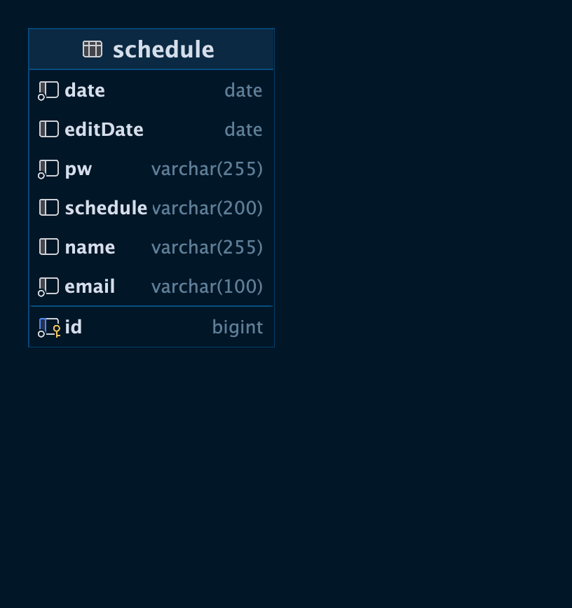

##Scheduler
스케줄을 만들고 저장,조회,수정,삭제 기능이 있는 어플리케이션 입니다.

##스케줄 생성
URL: /api/schedules
Method: POST
Request Body: { "name" : "스파르타", "schedule" : "일하자", "email" : "aaa@naver.com", "date" : "2024-08-16", "pw" : "1234"}
Content-Type: application/json
Description: 새로운 스케줄을 생성하기 위한 요청 데이터입니다.

##스케줄 조회
URL: /api/schedules
Method: GET
Request Body: 없음
Content-Type: application/json
Description: 모든 스케줄의 목록을 반환합니다.

##스케줄 수정
URL: /api/schedules/{id}
Method: PUT
Path Parameter:
id: 수정할 스케줄의 ID (Long)
Request Body: { "name" : "길용진", "schedule" : "일할까?", "email" : "aaa@naver.com", "date" : "2024-08-16", "pw" : "1234"}
Content-Type: application/json
Description: 수정할 스케줄의 데이터입니다.

##스케줄 삭제
URL: /api/schedules/{id}
Method: DELETE
Path Parameter:
id: 삭제할 스케줄의 ID (Long)
Content-Type: application/json
Description: 삭제된 스케줄의 ID를 반환합니다.

##DataBase
